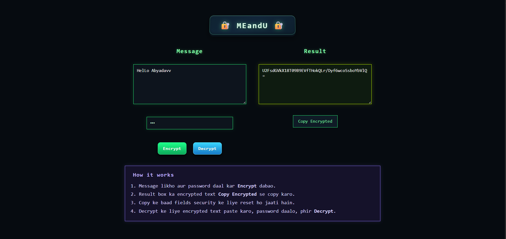
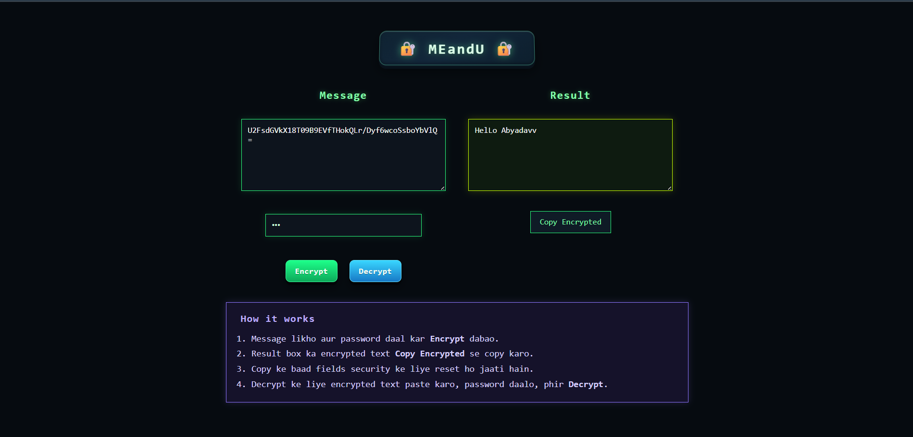

# MEandU Encryptor

`meandu-encryptor` is a simple and secure text encryption/decryption web app built with CryptoJS.

## Live Demo
- https://abyyadavv.github.io/meandu-encryptor/

## Screenshots

## Topics
`encryption`, `cryptography`, `javascript`, `pwa`, `security`, `text-encryptor`

## Features
- Encrypt plain text with a password
- Decrypt encrypted text with the same password
- One-click copy for encrypted output
- Responsive UI for mobile and desktop
- PWA support (installable app)

## Tech Stack
- HTML, CSS, JavaScript
- CryptoJS (loaded via CDN)

## Project Structure
- `index.html` — Main app UI
- `style.css` — Styling and responsive layout
- `script.js` — Encryption, decryption, and copy logic
- `manifest.webmanifest` — PWA metadata
- `service-worker.js` — Offline caching support
- `icons/` — App icons

## Open-source Note
This project uses CryptoJS, which is distributed under the MIT License.

## Local Run
Open the project using a local server (recommended for PWA features):
1. Serve the project folder
2. Open `index.html` in browser through localhost

## Deployment (GitHub Pages)
1. Push this project to a GitHub repository
2. Open repository `Settings` → `Pages`
3. Under Source, select `Deploy from a branch`
4. Choose `main` branch and `/ (root)` folder
5. Save and wait for the live URL

## How to Use
1. Enter a message in the Message box
2. Enter a password
3. Click `Encrypt`
4. Copy encrypted text from Result
5. To decrypt, paste encrypted text, enter same password, click `Decrypt`

## Future Improvements
- Add show/hide password toggle
- Add language toggle (Hindi/English)
- Add toast notifications instead of alert popups
